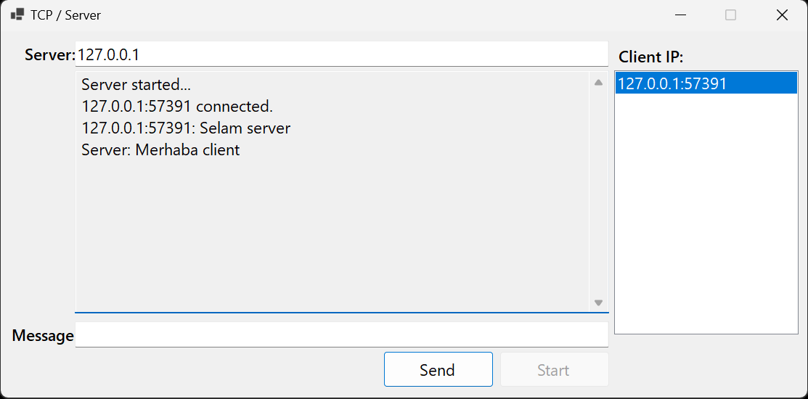
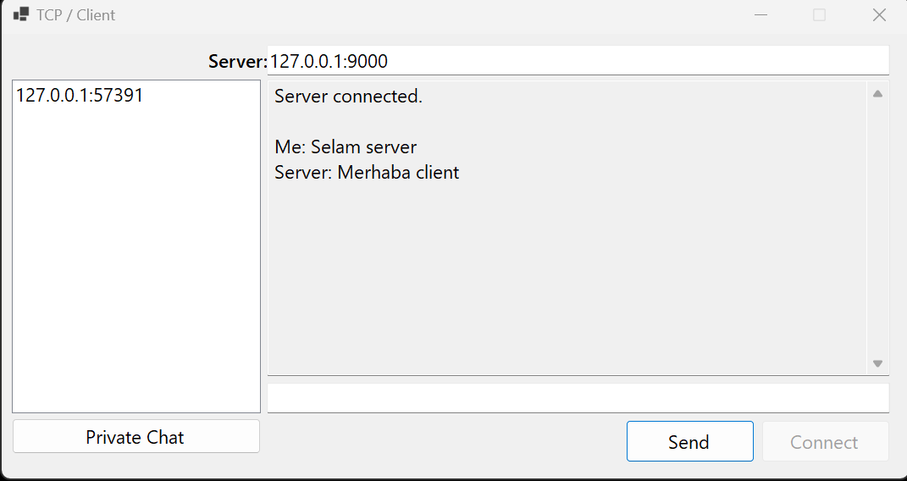

<h1 align="center">BasicTcpChat</h1>

<p align="center">
  <strong>TCP/IP tabanlı mesajlaşma uygulaması
</strong>
</p>

<p align="center">
  <a href="#açıklama">Açıklama</a> •
  <a href="#gereksinimler">Gereksinimler</a> •
  <a href="#kurulum">Kurulum</a> •
  <a href="#kullanım">Kullanım</a> •
  <a href="#özellikler">Özellikler</a> •
  <a href="#ekran-görüntüleri">Ekran Görüntüleri</a> •
  <a href="#katkıda-bulunma">Katkıda Bulunma</a> •
  <a href="#lisans">Lisans</a>
</p>

---

## Açıklama

**BasicTcpChat**, TCP/IP tabanlar Server ve Client arasında mesajlaşma uygulamasıdır. Multiple client özelliği mevcuttur.


### Gereksinimler

Uygulamayı başlatmak için aşağıdaki gereksinimlere ihtiyacınız vardır:

- Windows işletim sistemi
- .NET Framework 4.5 veya daha üstü

### Kurulum

1. Bu deposu yerel makinenize kopyalayın veya ZIP olarak indirin.
2. Visual Studio veya başka bir C# geliştirme ortamında projeyi açın.
3. Server ve client kodlarını düzenleyip derleyin.
4. Server'ı başlatın ve istemcileri bağlayın.

### Server/Client Ayarı
```csharp
private SimpleTcpClient server = new SimpleTcpClient("127.0.0.1", 9000);
private SimpleTcpClient client = new SimpleTcpClient("127.0.0.1", 9000);
```


## Kullanım

**BasicTcpChat** kullanımı oldukça basittir. İşte temel kullanım adımları:

1. Server'ı başlatın.
2. İstemcileri bağlayın.
3. Mesajlaşmaya başlayın.


## Özellikler

- Server ve client olmak üzere iki temel bileşen içerir.
- Bağlı olan tüm istemcilere anlık mesaj gönderme.
- Yeni istemcilerin bağlantı ve ayrılma olaylarını takip etme.
- Bağlı istemcilere bağlılık durumunu güncelleyen kullanıcı listesi.

## Ekran Görüntüleri

<table>
  <tr>
    <th>Server</th>
     <th>Client</th>
  </tr>
  <tr>
    <td></td>
    <td></td>
  </tr>
 </table>


## Katkıda Bulunma

Bu projeye katkıda bulunmak isterseniz, lütfen bir çekme isteği gönderin. Katkılarınızı memnuniyetle karşılarız.

## Lisans

Bu proje MIT Lisansı altında lisanslanmıştır. Daha fazla bilgi için [LICENSE](LICENSE.txt) dosyasına bakın.